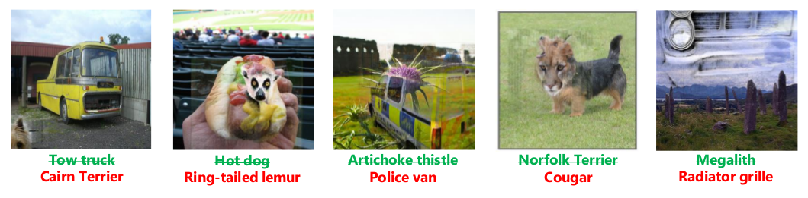

# Copy and Paste: A Simple But Effective Initialization Method for Black-Box Adversarial Attacks - [arXiv](https://arxiv.org/abs/1906.06086)

This is the exact implementation as used for Run #3 in the paper. 

Usage:
1. Download checkpoints for both models (see instructions in `models/*/checkpoints/README.md`)

2. Specify imagenet_base_path in `precalc_saliency_maps.py` and `run_imagenet_bench.py`.

2. Precalculate saliency maps for the entire ImageNet validation set. 

    `python3 precalc_saliency_maps.py`
    
   We found this to take ~48 hours on a Geforce 1070.
   The script saves each image individually and resumes where it left off, so you can simply run multiple instances in parallel from the same directory. 
   If you have a 4 GPU machine it will finish overnight.
   
3. Start the main benchmark. 
    
    `python3 precalc_saliency_maps.py`
    
   Our implementation of the Boundary Attack does **not** batch requests to the black box, in order to mimic a real attack and keep queries minimal. This also means that the attacks are pretty slow - expect a minute or two for a single image. Again, you can run multiple instances in parallel from the same directory.
   
4. Find detailed output in the `out_imagenet_bench`. For every run, all successful steps are logged, so you can watch the current progress at all times.
   

Concerning hyperparameters: The source code has "MODIFIED:" markers, which explain the changes we made to the biased Boundary Attack and its hyperparameters, differing from the ones originally used by Brunner et al.

